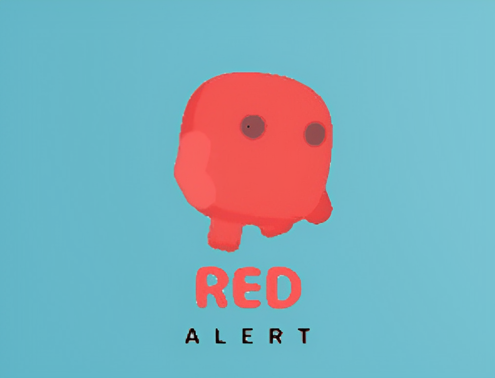
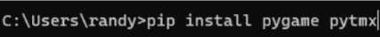

  
   

  <h3><b>Red Alert</b></h3>

# 📖 Red Alert 

an endless platformer game where the player can control the character to navigate through the levels, avoiding obstacles. It is an endless-level type of game, so there wouldn’t be an ending to this game, as the player’s goal is to get the maximum distance possible. 

## 🚀 Video Demo 

- [Click here](https://drive.google.com/file/d/1p7alJ9XS5dKSrnsjYK-3HINQ7tVBTIYQ/view?usp=share_link)

## 💻 Install 
- [Click here](https://minhaskamal.github.io/DownGit/#/home?url=https://github.com/GuhD01/Red-Alert)

to run the game please download pygame and pytmx libraries in cmd by using this command:

## 👥Developer 
Gde Ngurah Randy Agastya
 2602119165

- GitHub: [Click Here](https://github.com/GuhD01)

